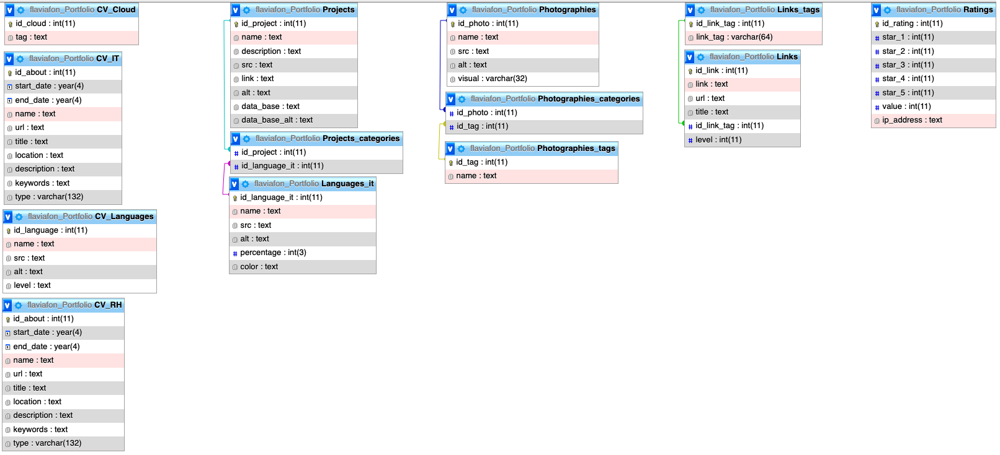

# Portofolio V2 (monthly update)
## Table of Contents

1. [General Info](#general-info)
2. [Stacks](#stacks)
3. [Installation](#installation)
4. [Pages](#pages)
5. [Database](#database)
6. [Use](#use)
7. [TODO](#todo)
8. [FAQs](#faqs)

<br/>

### General Info

---

My personal CV to promote myself.

<br/>

### Stacks

---
- [Node.js](https://nodejs.org/en/): Version 18.2.0
- [Express](https://expressjs.com/): Version 4.18.1
- [JavaScript]()
- [CSS]()
- [MySQL](https://www.mysql.com/)

Modules/librairies :
- [mysql2](https://www.npmjs.com/package/mysql2): Version 2.3.3
- [nodemon](https://www.npmjs.com/package/nodemon): Version 2.0.19 
- [dotenv](https://www.npmjs.com/package/dotenv): Version 16.0.1
- [ejs](https://www.npmjs.com/package/ejs): Version 3.1.8
- [sequelize](https://sequelize.org): Version 6.21.3
- [sequelize-auto ](https://github.com/sequelize/sequelize-auto): Version 0.8.8


<br/>

### Installation

---
- Need Node.js

If not install, check : https://nodejs.org/en/

- Clone :
```
$ git clone https://github.com/FlavF/PortfolioV2
```

or

- Installation without clone :

```
$ cd ../path/to/the/file
$ npm init
$ npm install express --save
$ npm i mysql
$ npm install --save-dev nodemon //to not restart your node.js src/index.js everytime your changing your code
$ npm i dotenv  //For .env
//Create and Update your .env => look at ##Pages 
$ npm install ejs // view engine

```

- To start the app and check it

(don't forget to start MySql if you use a localhost mysql)

``` 
$ nodemon src/app.js
```

- To install sequelize for mysql :
[Sequelize](https://sequelize.org/docs/v6/getting-started/)

- To install models for a database already built :
[Sequelize-Auto](https://github.com/sequelize/sequelize-auto)

=> My laptop didn't like sequelize-auto : 
```
$ sequelize-auto -o "./models" -d sequelize_auto_test -h localhost -u my_username -p 5432 -x my_password -e postgres
```

=> So I replace it with : 
(replace databasename,user, password and path for models )

```
$ node ./node_modules/sequelize-auto/bin/sequelize-auto -o "src/models" -d databasename -h host -u user -p 3306 -x password -e mysql
```


<br/>

### Pages

---
partials
- header : logo and darkmode button
- footer : to contact and follow
- aside : menu

pages
- homepage : aside with menu, photo, menu
- about : CV details and CV.pdf
- link : links useful
- photography : my photographies
- project : project done
- opinion : rate the portfolio
- message : send a message
- error : if the page request doesn't exist

<br/>

#### Folders to update

- .env :

__Database

DB_HOST =

DB_NAME =

DB_USERNAME =

DB_PASSWORD =

__Port 

PORT = 

### Database
---


- certifications
- cloud
- IT
- languages IT
- language
- Link
- Photography
- Project
- Rating
- RH

<br/>

### Use

---
- My portfolio website : [Porfolio online ](https://flavproject.000webhostapp.com/CVPortfolio)

- to get to know me better : [Porfolio online - About](https://flavproject.000webhostapp.com/CVPortfolio/about)

- to run my projects : - to see my photographies : [Porfolio online - Project](https://flavproject.000webhostapp.com/CVPortfolio/project)

- to see my photographies : [Porfolio online - Photos](https://flavproject.000webhostapp.com/CVPortfolio/photography)

- to add links on the page : [Porfolio online - Links](https://flavproject.000webhostapp.com/CVPortfolio/link)

- to send your opinion about my website : [Porfolio online - Opinion](https://flavproject.000webhostapp.com/CVPortfolio/opinion)

- to send me a message : [Porfolio online - Message](https://flavproject.000webhostapp.com/CVPortfolio/message)


<br/>

### TODO

---
- [ ] Go from V1 PHP to V2 Node.js (keeps : CSS, JS, Views, database datas)
- [ ] % language better design (maybe not a circle, color for starter, senior)
- [ ] alert email when somebody add a link
- [ ] not showing the tag when no links inside the box
- [ ] loop to remake in Link page
- [ ] add links I know of
- [ ] color design to rethink and change
- [ ] get faster (see how to improve it ; Photographies size, shorter code, ...)
- [ ] English and French Version ?
- [ ] In header : Possibility to do the menu via database + loop AND datas to collect : href; class ; id ; title; icon
- [ ] to load on firebase or heroku

<br/>

### FAQs

---


